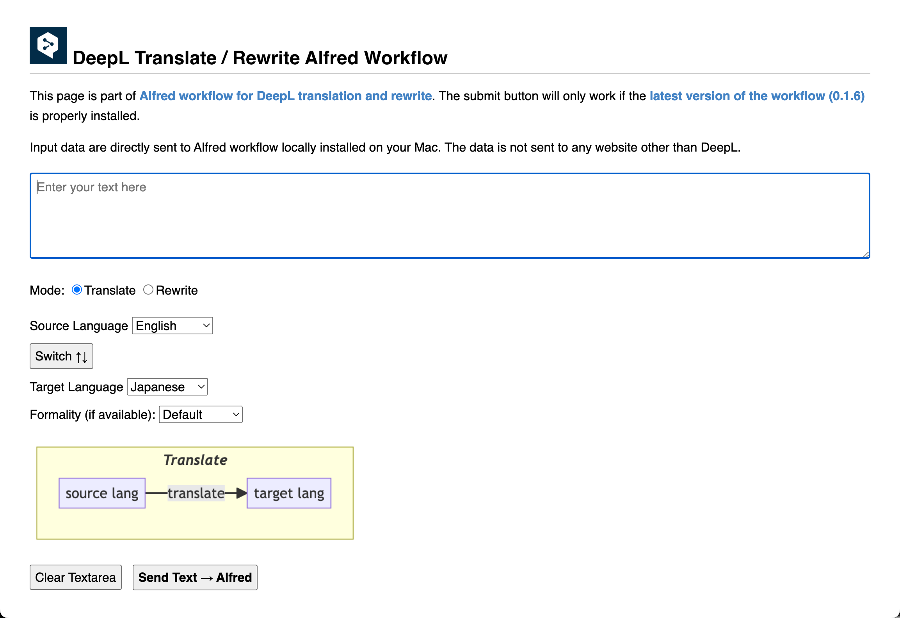

# DeepL Translate/Rewrite Workflow for Alfred

## Overview

An [Alfred workflow](https://www.alfredapp.com/workflows/) to help you translate and rewrite text using the [DeepL API](https://www.deepl.com/en/pro-api?cta=header-pro-api/) or the [Deepl free API](https://www.deepl.com/en/pro-api?cta=header-pro-api/).

The selected text can be used in any Mac application via hot keys. The source and target languages are automatically detected from one of the two languages specified in the settings `primary_lang` and `secondary_lang`. This means that if you want to translate or rewrite a text, regardless of whether it is in the primary or secondary language, all you have to do is select the text and press a hotkey.

There are other features including:

- Translate/Rewrite using a special HTML input form
- Document translation (file uploading and downloading)

## Downloads

**Current version**: `1.6.3`

[Download workflow](https://github.com/yohasebe/deepl-alfred-translate-rewrite-workflow/raw/main/deepl-alfred-translate-rewrite.alfredworkflow)

**Change Log**

- 1.6.3: Web interface updated to support `formality`
- 1.6.2: `formality` setting supported both in "translate" and "rewrite"
- 1.6.0: `formality` environment variable supported (default: `default`)
- 1.5.2: `speak` environment variable enabled (default: `false`)
- 1.5.1: Improvement of internal process
- 1.5.0: "deepl-textbox" command added
- 1.4.0: "check-for-update" command added
- 1.3.3: `open_file` environment valuable added
- 1.3.2: Switched to Alfred's native feature to retrieve selected text for performance and stability
- 1.3.1: Feature to translate/rewrite using Alfred's [universal action](https://www.alfredapp.com/universal-actions/)

## Setup

To start using this workflow, be sure to set the environment variables `auth_key`, `primary_lang`, and `secondary_lang` first. See [Setting-up](#setting-up) section below.

To translate or rewite text as a universal action, set up `selection hotkey` and enable `workflow file actions` and `workflow universal actions`.

## Check for Update

Type `check-for-update` and run the workflow. If there is a newer version, click on the "Download" button. The readme/download page on Github will open.

## Main Features

### Translate text

Translate text in `secondary_lang` to `primary_lang` and vice versa. You can use one of the following methods:

* Universal action
* Fallback search
* Keyword `deepl`
* System clipboard and keyword `deepl-clip`
* User-defined hotkey (→ text currently selected in front-most app is sent)

### Rewrite text

Rewrite text in one language by translating it to the other language and translating the resulting text back to the original language again. You can use one of the following methods:

* Universal action
* Keyword `deepl` with `⌘` key pressed
* System clipboard and keyword `deepl-clip` with `⌘` key pressed
* User-defined hotkey (→ text currently selected in front-most app will be submitted)

### Document translation

Translate documents of the type `.pptx`, `docx`, or `.pdf`. Upload the original file and then download the resulting file once the translation is complete. The translated file will be downloaded to the same folder as the original file.

Note: `max_characters` option is ignored for document translation.

**To upload the original file**

1. Specify the target file (using selection hotkey, for instance).
2. Select "DeepL Upload File" action.
3. Specify if the translation is from `secondary_lang` to `primary_lang` (EN to JA, for instance) or the other way round (JA to EN, for instance).

Or alternatively, you can use a workflow file action `DeepL Upload File`.

**To download the translated file**

1. Select "DeepL Download File" script filter by typing `deepl-download`.
2. Specify the title of the file from the list.
3. Download will begin if the translation is complete. Otherwise, the current status (queued, translating, or error) will be displayed .

See also [DeepL API: Translating documents](https://www.deepl.com/docs-api/translating-documents/).

https://user-images.githubusercontent.com/18207/201455994-ea5cd80b-3438-48a0-8e11-c25150ff5288.mp4

### Special Input Form in Default Browser

You can open a special input form in your default browser. To open this form, use the keyword `deepl-textbox` or a hotkey. When using this special input form, the `primary_lang` and `secondary lang` settings are ignored. You can specify the languages using selectors and change modes (translate or rewrite) using radio buttons. These settings are stored in the browser and can be used later.

<kbd>
    
</kbd>

### Monitor Usage

You can check how much text characters you have translated so far in the current billing period as well as the limits you set on DeepL Setting Page. Type in the keyword `deepl-usage`.

## Requirements

To use this Alfred workflow, you need a **DeepL API free** or **DeepL API Pro** account. Create one at the following URL.

https://www.deepl.com/pro/change-plan#developer

**Note:** The DeepL API is only available to DeepL developer API accounts (free or professional). It is not available (at the time of this writing) for regular personal DeepL accounts.

## Setting Up

Before you start using this Alfred workflow, you must set values to the following variables (use `[x]` button in Alfred's Workflow Setting Panel):

**Mandatory Variables**

| Variable       | Explanation                                                          |
| -------------- | -------------------------------------------------------------------- |
|`authkey`       | authentication key for DeepL API                                     |
|`primary_lang`  | sets the primary language (usually your native language)             |
|`secondary_lang`| sets the secondary language (usually the language you use DeepL for) |

**Available Languages**

| Code     | Language   |
| -------- | ---------- |
| `BG`     | Bulgarian  |
| `CS`     | Czech      |
| `DA`     | Danish     |
| `DE`     | German     |
| `EL`     | Greek      |
| `EN`     | English    |
| `ES`     | Spanish    |
| `ET`     | Estonian   |
| `FI`     | Finnish    |
| `FR`     | French     |
| `HU`     | Hungarian  |
| `ID`     | Indonesian |
| `IT`     | Italian    |
| `JA`     | Japanese   |
| `LT`     | Lithuanian |
| `LV`     | Latvian    |
| `NL`     | Dutch      |
| `PL`     | Polish     |
| `PT`     | Portuguese |
| `RO`     | Romanian   |
| `RU`     | Russian    |
| `SK`     | Slovak     |
| `SL`     | Slovenian  |
| `SV`     | Swedish    |
| `TR`     | Turkish    |
| `ZH`     | Chinese    |

**What are primary and secondary languages?**

This workflow translates/rewrites text written in either of the two languages set in the variables `primary_lang` and `secondary_lang`.

If you are a native user of Japanese who often work with text in English, for instance, Set `primary_lang` to `JA` and `secondary_lang` to `EN`.

## Options

In addition to the above variables, you can also modify values to the following DeepL API parameters. See [DeepL API](https://www.deepl.com/docs-api) for details.

### Optional DeepL Variables

| Variable            | Explanation                                                                       |
| ------------------- | ----------------------------------------------------------------------------------|
|`formality`          |sets whether the translated text should lean towards formal or informal language (`default`, `more`, `less`) |
|`split_sentences`    |sets whether the translation engine should first split the input into sentences  |
|`preserve_formatting`|sets whether the translation engine should respect the original formatting       |

Currently the `formality` option only works when the target language (`secondary_lang` in "translation" mode; `primary_lang` in "rewrite" mode) is one of these: `DE`, `FR`, `IT`, `ES`, `NL`, `PL`, `PT-PT`, `PT-BR`, `JA`, and `RU`.

### Utility Variables

There are a couple of additional parameters you can set to make the workflow more useful for you.

| Variable               | Explanation                                                                       |
| ---------------------- | ----------------------------------------------------------------------------------|
|`use_largetype`         |uses Alfred's large type functionality                                             |
|`max_characters`        |sets maximum number of characters accepted at a time                               |
|`ja_text_width`         |sets width of translated text when `secondary_lang` is set to `JA` (Japanese)      |
|`sound`                 |rings a chime when finished                                                        |
|`speak`                 |read aloud the response in the "system speech language" on your Mac                |
|`open_file`             |open the translation file once download is complete                                |

With `use_largetype` disabled, the workflow creates/updates a text file in the home directory (`~/deepl-translate-rewrite-latest.txt`) and opens it in the default text editing app.

#### Text to Speech

If the `speak` variable is set `true`, the result text will be read aloud in the system's standard language and voice. To change the language and speech, go to `[Accessibility]` - `[Vision]` -`[Spoken Content]` in the Mac Settings panel.

## Author

Yoichiro Hasebe (<yohasebe@gmail.com>)

## License

The MIT License

## Disclaimer

Please make sure you understand [the difference](https://support.deepl.com/hc/en-us/articles/360021183620-DeepL-API-Free-vs-DeepL-API-Pro) between the DeepL free API and the Deepl pro API.

The author of this software takes no responsibility for any damage that may result from using it.
