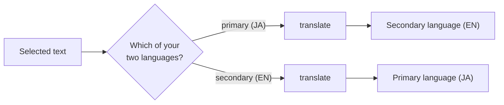
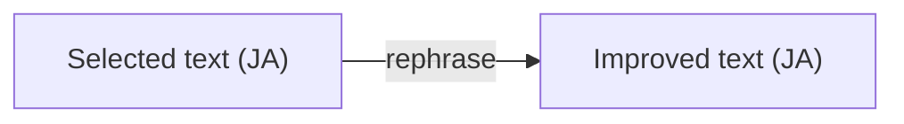
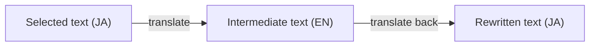
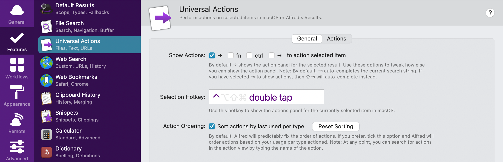
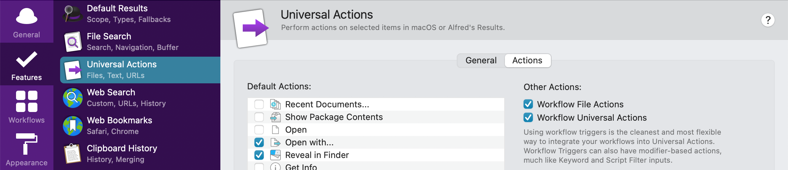
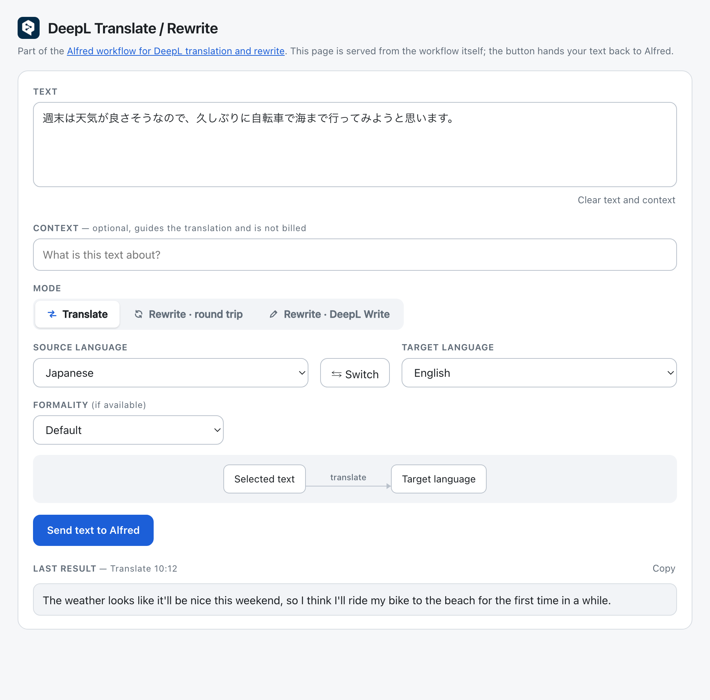
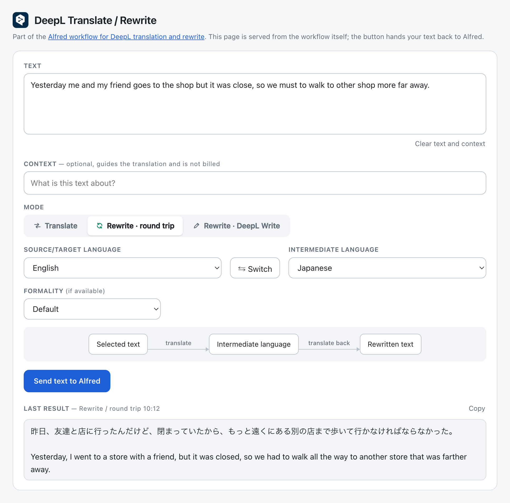
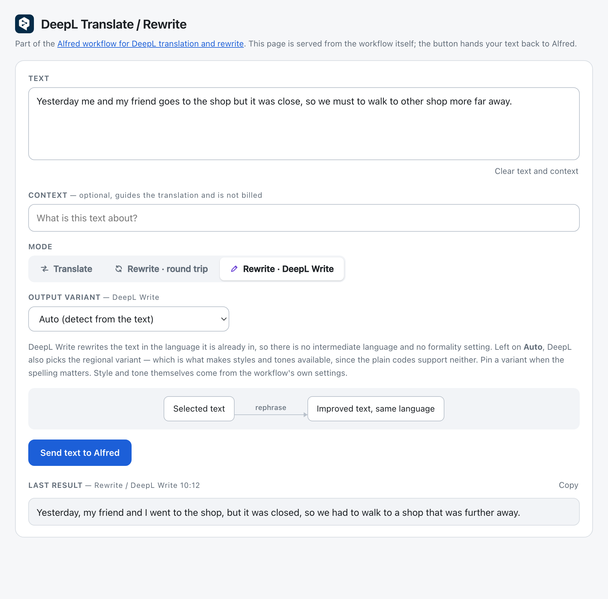

# DeepL Translate/Rewrite Workflow for Alfred


## Overview

An [Alfred workflow](https://www.alfredapp.com/workflows/) to help you translate and rewrite text using the [DeepL API](https://www.deepl.com/en/pro-api?cta=header-pro-api/) or the [Deepl free API](https://www.deepl.com/en/pro-api?cta=header-pro-api/).

The selected text can be used in any Mac application via hot keys. The source and target languages are automatically detected from one of the two languages specified in the settings `primary_lang` and `secondary_lang`. This means that if you want to translate or rewrite a text, regardless of whether it is in the primary or secondary language, all you have to do is select the text and press a hotkey.

**Translate**


```mermaid
flowchart LR
  IN["Selected text"] --> D{"Which of your<br/>two languages?"}
  D -->|"primary (JA)"| T1["translate"] --> O1["Secondary language (EN)"]
  D -->|"secondary (EN)"| T2["translate"] --> O2["Primary language (JA)"]
```

**Rewrite — DeepL Write** (`rewrite_engine` = `write_api`)


```mermaid
flowchart LR
  IN["Selected text (JA)"] -- rephrase --> OUT["Improved text (JA)"]
```

**Rewrite — round trip** (`rewrite_engine` = `round_trip`, the default)


```mermaid
flowchart LR
  IN["Selected text (JA)"] -- translate --> MID["Intermediate text (EN)"] -- translate back --> OUT["Rewritten text (JA)"]
```

Round trip shows the intermediate text alongside the result, and costs two translation requests instead of one.


There are other features including:

- Translate/Rewrite using a special HTML input form
- Document translation (file uploading and downloading)

## Downloads

**Current version**: `2.0.0`

[Download workflow](https://github.com/yohasebe/deepl-alfred-translate-rewrite-workflow/raw/main/deepl-alfred-translate-rewrite.alfredworkflow)

**Change Log**

- 2.0.0: The browser input form now ships inside the workflow instead of on GitHub Pages, shows the result of each request in place, offers both rewrite engines, and sizes its fields to their content; DeepL Write support (`rewrite_engine`, `writing_style`, `tone`, `write_target_lang`); `custom_instructions` and `model_type`; all settings moved to Alfred's Configure Workflow panel; formality support read from the DeepL API instead of a built-in list; 125 target languages; per-product usage reporting; more document formats and `enable_watermark`; document bookkeeping moved out of the workflow folder; HTTP timeouts. Fixed: the form's Context field was never sent; multi-line text from the form kept the formality marker as part of the text; the download list was sorted oldest-first
- 1.8.0: Fix API authentication for latest DeepL API; fix Large Type display issue on Alfred 5.7+; improve error handling; `context_input` default changed to off
- 1.7.0: `context` parameter (alpha feature) supported ([API documentation](https://developers.deepl.com/docs/best-practices/working-with-context))
- 1.6.3: Textbox (Web UI) updated to support `formality`
- 1.6.2: `formality` setting supported both in "translate" and "rewrite"
- 1.6.0: `formality` environment variable supported (default: `default`)
- 1.5.2: `speak` environment variable enabled (default: `false`)
- 1.5.1: Improvement of internal process
- 1.5.0: "deepl-textbox" command added
- 1.4.0: "check-for-update" command added
- 1.3.3: `open_file` environment valuable added
- 1.3.2: Switched to Alfred's native feature to retrieve selected text for performance and stability
- 1.3.1: Feature to translate/rewrite using Alfred's [universal action](https://www.alfredapp.com/universal-actions/)

## Setup

To start using this workflow, open **Configure Workflow** in Alfred and fill in your **DeepL API key**, **Primary language** and **Secondary language**. See [Setting-up](#setting-up) below.

To translate or rewite text as a universal action, set up `selection hotkey` and enable `workflow file actions` and `workflow universal actions`.





## Check for Update

Type `check-for-update` and run the workflow. If there is a newer version, click on the "Download" button. The readme/download page on Github will open.

## Main Features

### Translate text

Translate text in `secondary_lang` to `primary_lang` and vice versa. You can use one of the following methods:

* Universal action
* Fallback search
* Keyword `deepl`
* System clipboard and keyword `deepl-clip`
* User-defined hotkey (→ text currently selected in front-most app is sent)

### Rewrite text

Rewrite text in the language it is already written in. Two engines are available, selected with the `rewrite_engine` variable:

| `rewrite_engine` | How it works |
| ---------------- | ------------ |
| `round_trip` (default) | Translates the text to the other language and back again. Shows the intermediate translation alongside the result. Two translation requests, both billed. |
| `write_api` | Hands the text to [DeepL Write](https://developers.deepl.com/docs/api-reference/improve-text), which rephrases it in place. One request, billed separately from translation. Accepts `writing_style` and `tone`. |

`write_api` supports German, English, Spanish, French, Italian, Japanese, Korean, Portuguese, and Chinese. `writing_style` and `tone` apply to a smaller set still: German, English (British and American), Spanish, French, Italian, and Portuguese. Japanese is rephrased but takes neither, and in practice the change it makes to Japanese is slight — `round_trip` often rewrites Japanese more visibly.

You can use one of the following methods:

* Universal action
* Keyword `deepl` with `⌘` key pressed
* System clipboard and keyword `deepl-clip` with `⌘` key pressed
* User-defined hotkey (→ text currently selected in front-most app will be submitted)

### Document translation

Upload the original file and then download the resulting file once the translation is complete. The translated file will be downloaded to the same folder as the original file.

Supported formats: `.docx`, `.pptx`, `.xlsx`, `.pdf`, `.htm`/`.html`, `.txt`, `.srt`, `.xlf`/`.xliff` (1.2, 2.0 and 2.1), `.idml`, `.xml`, `.json`, `.dita`, and `.mif`. On API Pro, `.docx`, `.pptx` and `.pdf` may be up to 100 MB.

Setting `enable_watermark` to `true` stamps a "Translated by DeepL" watermark on the result. DeepL only applies it to `.docx` and `.pdf` output, so the workflow leaves it off for every other format.

Note: `max_characters` option is ignored for document translation.

**To upload the original file**

1. Specify the target file (using selection hotkey, for instance).
2. Select "DeepL Upload File" action.
3. Specify if the translation is from `secondary_lang` to `primary_lang` (EN to JA, for instance) or the other way round (JA to EN, for instance).

Or alternatively, you can use a workflow file action `DeepL Upload File`.

**To download the translated file**

1. Select "DeepL Download File" script filter by typing `deepl-download`.
2. Specify the title of the file from the list.
3. Download will begin if the translation is complete. Otherwise, the current status (queued, translating, or error) will be displayed .

See also [DeepL API: Translating documents](https://www.deepl.com/docs-api/translating-documents/).

https://user-images.githubusercontent.com/18207/201455994-ea5cd80b-3438-48a0-8e11-c25150ff5288.mp4

### Special Input Form in Default Browser

You can open a special input form in your default browser. To open this form, use the keyword `deepl-textbox` or a hotkey.

The form is part of the workflow rather than a hosted page: opening it writes a copy into the workflow's cache folder and opens that file, so it needs no network connection and nothing outside your Mac. Your current settings are baked into the page as it is written, which is also why the languages you configured appear in the selectors even when they are not among the ones listed there.

Languages and mode are chosen on the form itself, so `primary_lang` and `secondary_lang` do not constrain it. Your choices are remembered in the browser for next time. Mode offers all three routes:

| Mode | What it does |
| ---- | ------------ |
| Translate | Source language to target language |
| Rewrite &middot; round trip | Translates through the intermediate language and back |
| Rewrite &middot; DeepL Write | Rephrases in place; the language and formality selectors disappear because DeepL Write takes neither |

The first time you submit, your browser will ask whether to open Alfred. Allow it and the form works from then on.

When Alfred has finished, switch back to the browser: the result appears below the button, with the mode and time it came from, while your original text stays in place. That makes it easy to adjust the text and send it again. The fields grow with what is in them, and a **Copy** button puts the result on the clipboard.

Each screenshot shows the form after a request has come back: the result sits below the button while the original text stays editable.

**Translate**

<kbd>
    
</kbd>

**Rewrite — round trip**

<kbd>
    
</kbd>

**Rewrite — DeepL Write**

DeepL Write works out the language on its own and takes no formality setting, so the form drops the selectors that would have no effect.

<kbd>
    
</kbd>

### Monitor Usage

You can check how much text characters you have translated so far in the current billing period as well as the limits you set on DeepL Setting Page. Type in the keyword `deepl-usage`.

## Requirements

To use this Alfred workflow, you need a **DeepL API free** or **DeepL API Pro** account. Create one at the following URL.

https://www.deepl.com/pro/change-plan#developer

**Note:** The DeepL API is only available to DeepL developer API accounts (free or professional). It is not available (at the time of this writing) for regular personal DeepL accounts.

## Setting Up

Everything is configured from Alfred's **Configure Workflow** panel. Three settings are required before the workflow will run:

| Setting | Explanation |
| ------- | ----------- |
| DeepL API key | Authentication key for the DeepL API |
| Primary language | The language you usually write in (typically your native language) |
| Secondary language | The other language you work in |

**Available Languages**

DeepL supports 125 target languages, 114 of which can also be detected automatically as the source language. Commonly used codes are:

| Code | Language | Code | Language | Code | Language |
| ---- | -------- | ---- | -------- | ---- | -------- |
| `AR` | Arabic     | `HE` | Hebrew     | `PT-BR` | Portuguese (Brazilian) |
| `DA` | Danish     | `ID` | Indonesian | `PT-PT` | Portuguese (European)  |
| `DE` | German     | `IT` | Italian    | `RU` | Russian     |
| `EN` | English    | `JA` | Japanese   | `SV` | Swedish     |
| `EN-GB` | English (British)  | `KO` | Korean  | `TH` | Thai        |
| `EN-US` | English (American) | `NL` | Dutch   | `TR` | Turkish     |
| `ES` | Spanish    | `NB` | Norwegian Bokmal | `VI` | Vietnamese |
| `FR` | French     | `PL` | Polish     | `ZH-HANS` | Chinese (simplified)  |
| `FR-CA` | French (Canadian) | `PT` | Portuguese | `ZH-HANT` | Chinese (traditional) |

Use the regional code (`EN-US`, `PT-BR`, ...) when you want a specific variant as the **target**; the plain code (`EN`, `PT`, ...) is what DeepL reports when detecting a **source** language, so that is usually the better choice for `primary_lang` and `secondary_lang`.

<details>
<summary><b>Full list of supported languages</b></summary>

| Code | Language | Source | Target | `formality` |
| ---- | -------- | :----: | :----: | :---------: |
| `ACE` | Acehnese | ✓ | ✓ |  |
| `AF` | Afrikaans | ✓ | ✓ |  |
| `AN` | Aragonese | ✓ | ✓ |  |
| `AR` | Arabic | ✓ | ✓ |  |
| `AS` | Assamese | ✓ | ✓ |  |
| `AY` | Aymara | ✓ | ✓ |  |
| `AZ` | Azerbaijani | ✓ | ✓ |  |
| `BA` | Bashkir | ✓ | ✓ |  |
| `BE` | Belarusian | ✓ | ✓ |  |
| `BG` | Bulgarian | ✓ | ✓ |  |
| `BHO` | Bhojpuri | ✓ | ✓ |  |
| `BN` | Bengali | ✓ | ✓ |  |
| `BR` | Breton | ✓ | ✓ |  |
| `BS` | Bosnian | ✓ | ✓ |  |
| `CA` | Catalan | ✓ | ✓ |  |
| `CEB` | Cebuano | ✓ | ✓ |  |
| `CKB` | Kurdish (Sorani) | ✓ | ✓ |  |
| `CS` | Czech | ✓ | ✓ |  |
| `CY` | Welsh | ✓ | ✓ |  |
| `DA` | Danish | ✓ | ✓ |  |
| `DE` | German | ✓ | ✓ | ✓ |
| `DE-CH` | German (Swiss) |  | ✓ | ✓ |
| `DE-DE` | German |  | ✓ | ✓ |
| `EL` | Greek | ✓ | ✓ |  |
| `EN` | English | ✓ | ✓ |  |
| `EN-GB` | English (British) |  | ✓ |  |
| `EN-US` | English (American) |  | ✓ |  |
| `EO` | Esperanto | ✓ | ✓ |  |
| `ES` | Spanish | ✓ | ✓ | ✓ |
| `ES-419` | Spanish (Latin American) |  | ✓ | ✓ |
| `ET` | Estonian | ✓ | ✓ |  |
| `EU` | Basque | ✓ | ✓ |  |
| `FA` | Persian | ✓ | ✓ |  |
| `FI` | Finnish | ✓ | ✓ |  |
| `FR` | French | ✓ | ✓ | ✓ |
| `FR-CA` | French (Canadian) |  | ✓ | ✓ |
| `FR-FR` | French |  | ✓ | ✓ |
| `GA` | Irish | ✓ | ✓ |  |
| `GL` | Galician | ✓ | ✓ |  |
| `GN` | Guarani | ✓ | ✓ |  |
| `GOM` | Konkani | ✓ | ✓ |  |
| `GU` | Gujarati | ✓ | ✓ |  |
| `HA` | Hausa | ✓ | ✓ |  |
| `HE` | Hebrew | ✓ | ✓ |  |
| `HI` | Hindi | ✓ | ✓ |  |
| `HR` | Croatian | ✓ | ✓ |  |
| `HT` | Haitian Creole | ✓ | ✓ |  |
| `HU` | Hungarian | ✓ | ✓ |  |
| `HY` | Armenian | ✓ | ✓ |  |
| `ID` | Indonesian | ✓ | ✓ |  |
| `IG` | Igbo | ✓ | ✓ |  |
| `IS` | Icelandic | ✓ | ✓ |  |
| `IT` | Italian | ✓ | ✓ | ✓ |
| `JA` | Japanese | ✓ | ✓ | ✓ |
| `JV` | Javanese | ✓ | ✓ |  |
| `KA` | Georgian | ✓ | ✓ |  |
| `KK` | Kazakh | ✓ | ✓ |  |
| `KMR` | Kurdish (Kurmanji) | ✓ | ✓ |  |
| `KO` | Korean | ✓ | ✓ |  |
| `KY` | Kyrgyz | ✓ | ✓ |  |
| `LA` | Latin | ✓ | ✓ |  |
| `LB` | Luxembourgish | ✓ | ✓ |  |
| `LMO` | Lombard | ✓ | ✓ |  |
| `LN` | Lingala | ✓ | ✓ |  |
| `LT` | Lithuanian | ✓ | ✓ |  |
| `LV` | Latvian | ✓ | ✓ |  |
| `MAI` | Maithili | ✓ | ✓ |  |
| `MG` | Malagasy | ✓ | ✓ |  |
| `MI` | Maori | ✓ | ✓ |  |
| `MK` | Macedonian | ✓ | ✓ |  |
| `ML` | Malayalam | ✓ | ✓ |  |
| `MN` | Mongolian | ✓ | ✓ |  |
| `MR` | Marathi | ✓ | ✓ |  |
| `MS` | Malay | ✓ | ✓ |  |
| `MT` | Maltese | ✓ | ✓ |  |
| `MY` | Burmese | ✓ | ✓ |  |
| `NB` | Norwegian (bokmål) | ✓ | ✓ |  |
| `NE` | Nepali | ✓ | ✓ |  |
| `NL` | Dutch | ✓ | ✓ | ✓ |
| `OC` | Occitan | ✓ | ✓ |  |
| `OM` | Oromo | ✓ | ✓ |  |
| `PA` | Punjabi | ✓ | ✓ |  |
| `PAG` | Pangasinan | ✓ | ✓ |  |
| `PAM` | Kapampangan | ✓ | ✓ |  |
| `PL` | Polish | ✓ | ✓ | ✓ |
| `PRS` | Dari | ✓ | ✓ |  |
| `PS` | Pashto | ✓ | ✓ |  |
| `PT` | Portuguese | ✓ | ✓ | ✓ |
| `PT-BR` | Portuguese (Brazilian) |  | ✓ | ✓ |
| `PT-PT` | Portuguese (European) |  | ✓ | ✓ |
| `QU` | Quechua | ✓ | ✓ |  |
| `RO` | Romanian | ✓ | ✓ |  |
| `RU` | Russian | ✓ | ✓ | ✓ |
| `SA` | Sanskrit | ✓ | ✓ |  |
| `SCN` | Sicilian | ✓ | ✓ |  |
| `SK` | Slovak | ✓ | ✓ |  |
| `SL` | Slovenian | ✓ | ✓ |  |
| `SQ` | Albanian | ✓ | ✓ |  |
| `SR` | Serbian | ✓ | ✓ |  |
| `ST` | Sesotho | ✓ | ✓ |  |
| `SU` | Sundanese | ✓ | ✓ |  |
| `SV` | Swedish | ✓ | ✓ |  |
| `SW` | Swahili | ✓ | ✓ |  |
| `TA` | Tamil | ✓ | ✓ |  |
| `TE` | Telugu | ✓ | ✓ |  |
| `TG` | Tajik | ✓ | ✓ |  |
| `TH` | Thai | ✓ | ✓ |  |
| `TK` | Turkmen | ✓ | ✓ |  |
| `TL` | Tagalog | ✓ | ✓ |  |
| `TN` | Tswana | ✓ | ✓ |  |
| `TR` | Turkish | ✓ | ✓ |  |
| `TS` | Tsonga | ✓ | ✓ |  |
| `TT` | Tatar | ✓ | ✓ |  |
| `UK` | Ukrainian | ✓ | ✓ |  |
| `UR` | Urdu | ✓ | ✓ |  |
| `UZ` | Uzbek | ✓ | ✓ |  |
| `VI` | Vietnamese | ✓ | ✓ |  |
| `WO` | Wolof | ✓ | ✓ |  |
| `XH` | Xhosa | ✓ | ✓ |  |
| `YI` | Yiddish | ✓ | ✓ |  |
| `YUE` | Cantonese | ✓ | ✓ |  |
| `ZH` | Chinese | ✓ | ✓ |  |
| `ZH-HANS` | Chinese (simplified) |  | ✓ |  |
| `ZH-HANT` | Chinese (traditional) |  | ✓ |  |
| `ZU` | Zulu | ✓ | ✓ |  |

</details>

**What are primary and secondary languages?**

This workflow translates/rewrites text written in either of the two languages set in the variables `primary_lang` and `secondary_lang`.

If you are a native user of Japanese who often work with text in English, for instance, Set `primary_lang` to `JA` and `secondary_lang` to `EN`.

## Options

The rest of **Configure Workflow** is optional. The variable names below are what the settings are called internally, in case you want to set them from a script or an external trigger. See [DeepL API](https://www.deepl.com/docs-api) for the underlying parameters.

### Translation and Rewriting

| Variable            | Explanation                                                                       |
| ------------------- | ----------------------------------------------------------------------------------|
|`formality`            |sets whether the translated text should lean towards formal or informal language (`default`, `more`, `less`, `prefer_more`, `prefer_less`) |
|`split_sentences`      |sets whether the translation engine should first split the input into sentences  |
|`preserve_formatting`  |sets whether the translation engine should respect the original formatting       |
|`model_type`           |picks the translation model (`quality_optimized`, `prefer_quality_optimized`, `latency_optimized`); leave empty to let DeepL choose |
|`custom_instructions`  |free-form instructions that steer the translation, one per line (up to 10 lines of 300 characters) |
|`rewrite_engine`       |how "rewrite" mode works: `round_trip` (default) or `write_api` |
|`writing_style`        |DeepL Write style when `rewrite_engine` is `write_api`: `academic`, `business`, `casual`, `simple` |
|`tone`                 |DeepL Write tone when `rewrite_engine` is `write_api`: `confident`, `diplomatic`, `enthusiastic`, `friendly` |
|`write_target_lang`    |pins the language variant DeepL Write rewrites into, e.g. `EN-US`; leave empty to let DeepL choose |
|`enable_watermark`     |stamps a "Translated by DeepL" watermark on translated `.docx` and `.pdf` documents |

The `formality` option only applies when the target language (`secondary_lang` in "translation" mode; `primary_lang` in "rewrite" mode) supports it. The workflow asks the DeepL API which languages those are and caches the answer for a week, so newly supported languages start working without an update. See the `formality` column in the language table above.

#### Custom Instructions

`custom_instructions` lets you tell DeepL how to translate, in plain language. Write one instruction per line:

```
Keep technical terms in English (do not transliterate into katakana).
Use plain, non-polite form.
```

For example, "The attention mechanism improves the encoder-decoder model." is translated into Japanese as
`アテンションメカニズムは、エンコーダー・デコーダーモデルを向上させます。` by default, and as
`Attention Mechanismは、Encoder-Decoderモデルを向上させる。` with the two instructions above.

Not every target language accepts custom instructions. The workflow checks with the DeepL API and simply omits them when the target language does not support them.

#### DeepL Write Styles and Tones

`writing_style` and `tone` are mutually exclusive — set one or the other, not both. The same English sentence, rewritten by `write_api`:

| Setting | Result |
| ------- | ------ |
| (none) | I think this paper is really interesting, but it's quite difficult to follow. |
| `writing_style` = `academic` | The paper is intriguing, but the presentation is challenging to comprehend. |
| `tone` = `diplomatic` | This paper is quite intriguing, though I must admit it was somewhat challenging to comprehend. |

Both settings are sent to DeepL in their `prefer_` form. When `write_target_lang` is empty the language is detected rather than declared, so a detected language with no styles or tones falls back to a plain rewrite instead of failing — the setting is quietly ignored in that case.

Leaving `write_target_lang` empty lets DeepL pick the regional variant, which is what makes styles and tones available at all: the base codes (`EN`, `PT`) support neither. The trade-off is that DeepL may pick British spelling on one run and American on the next. Set `write_target_lang` to `EN-US` or `EN-GB` to pin it.

When `write_target_lang` *is* set, the workflow checks it against the languages DeepL Write accepts and reports an error rather than sending text that would come back unchanged — so pinning `EN` while asking for `academic` tells you to use `EN-US` instead of silently dropping the style.

### Output and Behaviour

| Variable               | Explanation                                                                  |
| ---------------------- | -----------------------------------------------------------------------------|
|`use_largetype`         |shows the result in Alfred's Large Type                                       |
|`max_characters`        |refuses input longer than this, as a guard against translating something huge by accident |
|`ja_text_width`         |wraps Japanese results at this many characters per line                       |
|`sound`                 |plays a chime when finished                                                   |
|`speak`                 |reads the result aloud in the "system speech language" on your Mac            |
|`open_file`             |opens the translated document once the download is complete                   |
|`context_input`         |adds a step that lets you type context before translating                     |

With `use_largetype` disabled, the workflow creates/updates a text file in the home directory (`~/deepl-translate-rewrite-latest.txt`) and opens it in the default text editing app.

### Advanced

One setting is deliberately kept out of **Configure Workflow**, in the `[x]` environment variables panel instead, because it is a DeepL API detail that rarely needs changing:

| Variable            | Explanation                                                                       |
| ------------------- | ----------------------------------------------------------------------------------|
|`split_sentences`    |how DeepL splits the input into sentences: `0` (no splitting), `1` (punctuation and newlines) or `nonewlines` (punctuation only) |

#### Text to Speech

If the `speak` variable is set `true`, the result text will be read aloud in the system's standard language and voice. To change the language and speech, go to `[Accessibility]` - `[Vision]` -`[Spoken Content]` in the Mac Settings panel.


## Author

Yoichiro Hasebe (<yohasebe@gmail.com>)

## License

The MIT License

## Disclaimer

Please make sure you understand [the difference](https://support.deepl.com/hc/en-us/articles/360021183620-DeepL-API-Free-vs-DeepL-API-Pro) between the DeepL free API and the Deepl pro API.

The author of this software takes no responsibility for any damage that may result from using it.
